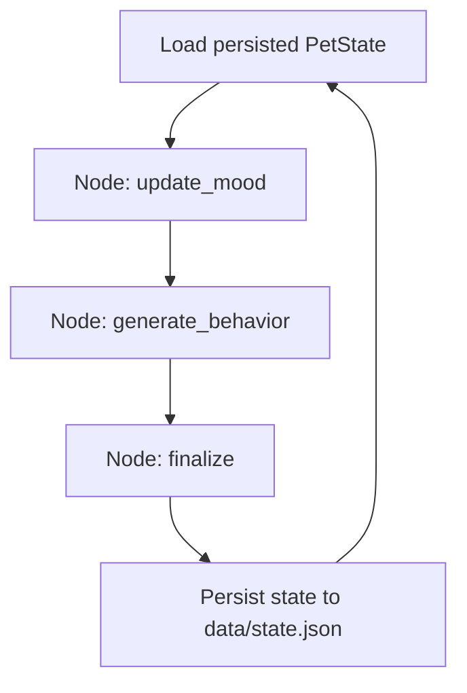

# 🐶 Ambient Virtual Pet Care
*A Stateful Agentic AI Demo powered by LangGraph*

---

## Project Goal

The main purpose of this project is to demonstrate **stateful agentic AI** with **LangGraph**.

Instead of a one-off response model, this agent runs as a persistent loop:

- reads and updates state every cycle
- carries memory forward across cycles
- makes behavior decisions from current context
- persists state for the next step

This is a practical example of moving from **stateless chat** to a **continuous state machine agent**.

---

## What Makes It Agentic + Stateful

This project uses a LangGraph workflow where each node has a clear role:

1. **Mood Node**: derives current dog state from a simulated calendar slot
2. **Behavior Node**: generates state-aligned speech text
3. **Finalize Node**: updates timestamps and persists state

State is stored in `data/state.json`, so each loop builds on previous data rather than starting from scratch.

---

## Current Behavior Model

The demo intentionally uses a simple 3-state model to make state transitions obvious:

- `ready_for_walk`
- `need_attention`
- `sleeping`

A simulated personal calendar rotates slots every 30 seconds for demo purposes.  
Each active slot maps to one dog state, and that state drives:

- UI state label
- matching dog video
- matching speech bubble text

---

## LangGraph Workflow



---

## Demo UI

The Streamlit UI renders:

- top state panel + speech bubble
- simulated personal calendar (left)
- mood-mapped dog video (right)

The UI does not invent its own state logic anymore; it renders what the graph produces, so CLI and UI stay consistent.

---

## Tech Stack

- Python
- LangGraph
- Pydantic
- Streamlit

---

## 🚀 Getting Started

Install dependencies:

```bash
pip install -r requirements.txt
```

Create your local env file (kept for compatibility with optional extensions):

```bash
cp .env.example .env
```

Run the Streamlit demo:

```bash
streamlit run ui/streamlit_app.py
```

Optional CLI loop:

```bash
python main.py
```
